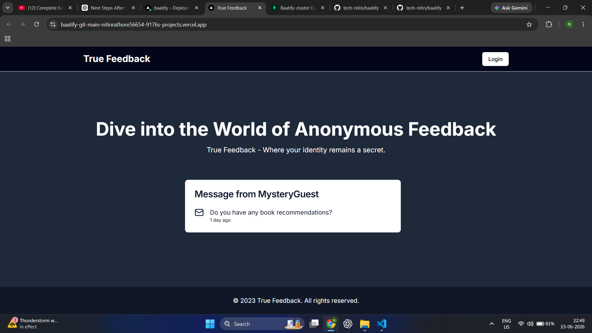
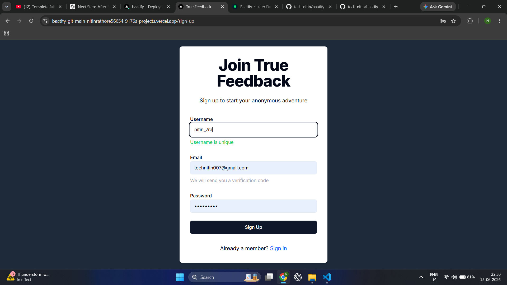
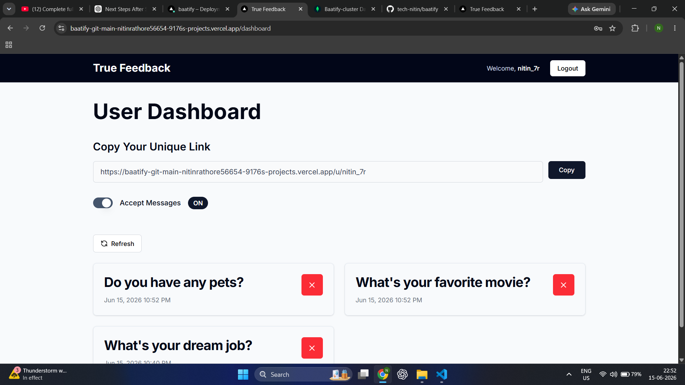

# 🚀 True Feedback

True Feedback is a full-stack anonymous feedback platform where users can create an account, share a unique link, and receive anonymous messages from anyone without revealing the sender's identity.

## 🌐 Live Demo

https://baatify-git-main-nitinrathore56654-9176s-projects.vercel.app/

---

## ✨ Features

* 🔐 User Authentication with NextAuth
* 📧 Email Verification using Resend
* 📨 Receive Anonymous Messages
* 🔗 Unique Public Profile Link
* 🎚️ Toggle Accept Messages ON/OFF
* 🗑️ Delete Messages
* 📋 Copy Shareable Profile Link
* 🔄 Refresh Messages
* 📱 Responsive UI
* ☁️ Deployed on Vercel

---

## 🛠️ Tech Stack

### Frontend

* Next.js
* React
* TypeScript
* Tailwind CSS
* Shadcn UI

### Backend

* Next.js API Routes
* NextAuth

### Database

* MongoDB Atlas
* Mongoose

### Other Services

* Resend (Email Service)
* Vercel (Deployment)

---

## 📂 Project Structure

```text
src/
│
├── app/
├── components/
├── helpers/
├── lib/
├── model/
├── schemas/
├── types/
├── context/
├── messages.json
└── proxy.ts
```

## ⚙️ Environment Variables

Create a `.env.local` file.

```env
MONGODB_URI=

NEXTAUTH_SECRET=

NEXTAUTH_URL=

RESEND_API_KEY=
```

---

## 🚀 Run Locally

Clone the repository

```bash
git clone https://github.com/tech-nitin/baatify.git
```

Navigate to the project folder:

```bash
cd baatify
```

Install dependencies

```bash
npm install
```

Start development server

```bash
npm run dev
```

Open:

```text
http://localhost:3000
```

---

## 🔄 Application Workflow

```text
User Signup
        ↓
Email Verification
        ↓
Login
        ↓
Dashboard
        ↓
Copy Unique Link
        ↓
Receive Anonymous Messages
```

---


## 📸 Screenshots

### Home Page



### Sign Up Page



### Dashboard



---

## 🎯 Future Improvements

* 🔔 Real-time notifications
* 🌙 Dark mode
* 📊 Analytics dashboard
* ❤️ Message reactions
* 📌 Pin important messages

---

## 👨‍💻 Author

Nitin Rathore

GitHub: https://github.com/tech-nitin

LinkedIn: https://www.linkedin.com/in/nitin-rathore-a464b8380/

---

⭐ If you like this project, don't forget to star the repository.
